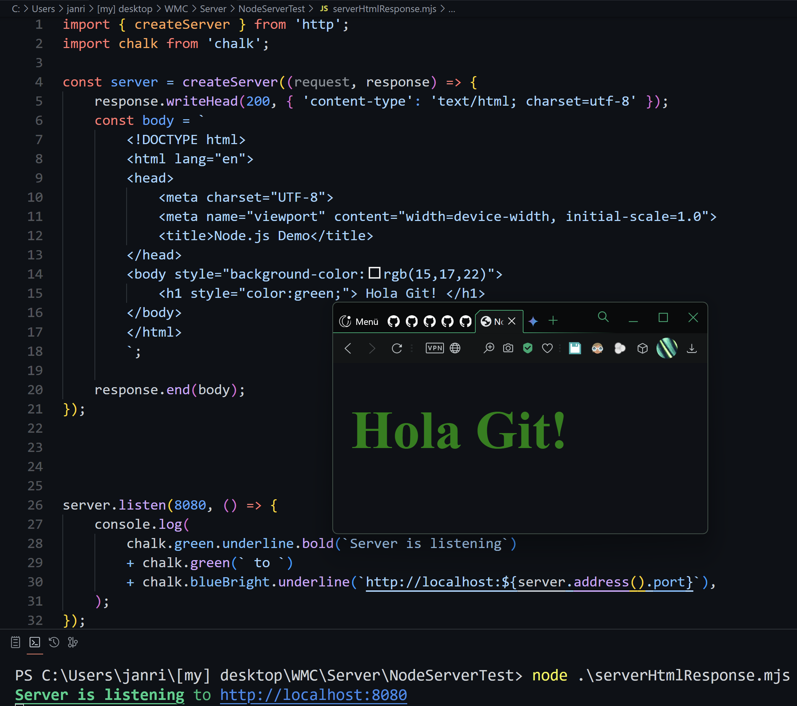
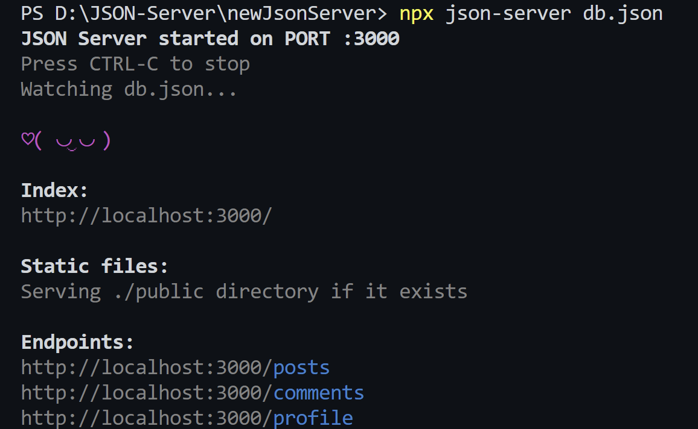
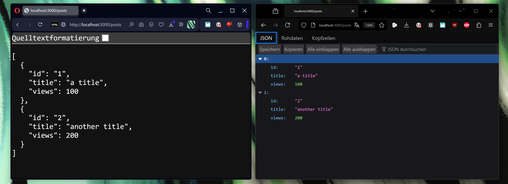

###### 
 WmcUebung-004 

- ### *To test my javascript skills i first made myself a "playground environment"*:

  
  

---
- ## *Overview of the .html "playground"-file*

  
  

- ## *Overview of the .js "playground"-file*

  

---

- ## *HTTP SERVER:*

  

- ## *JSON-SERVER:*

  

> *On different browsers, the shown json might differ:*
> 

>
>    
>  

---

